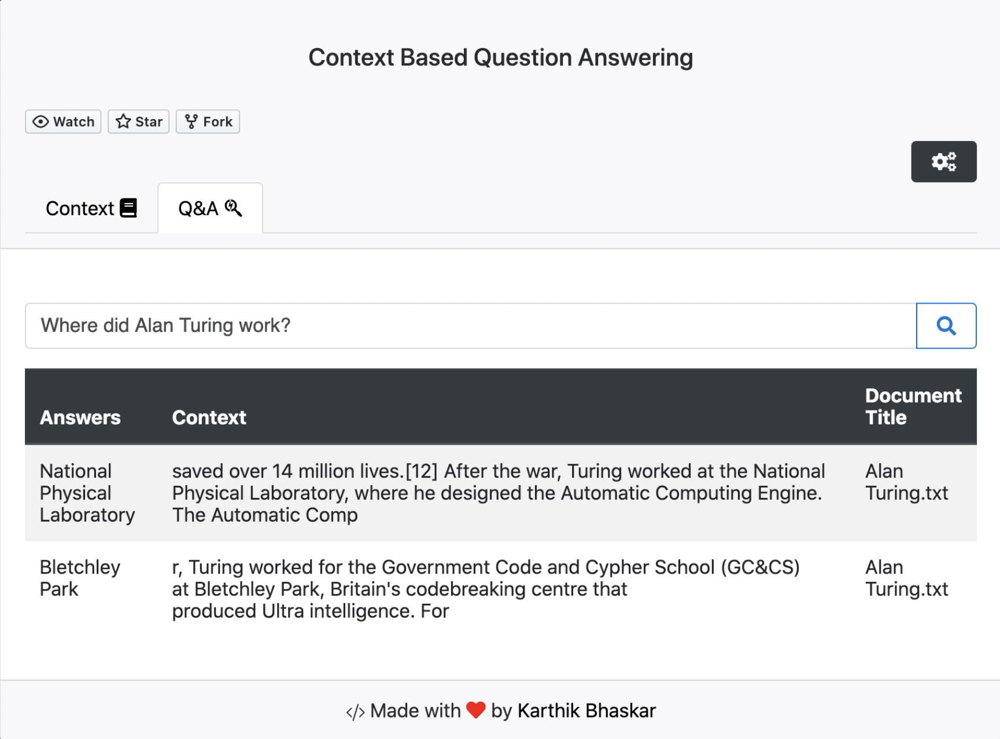

# Context-Based-Question-Answering
Context Based Question Answering(CBQA) is an inference web-based search engine, which can answer the questions provided a context is given in the form of documents or any textual content, using pre-trained transformers based models such as BERT, RoBERTa, DistilBERT accessed through the pipelines provided by Haystack library(which is an end-to-end framework for QA & Neural search)

Example: 

Note: The changes to this repository currently in progress.
